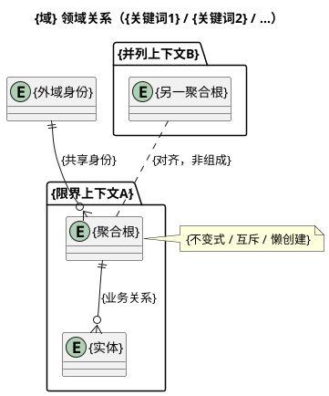
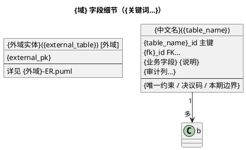

# PlantUML 模板

无同仓先例时使用。有 `*-ER.puml` / `*-字段细节.puml` 时：ER 优先模仿**骨架型**（中文实体 + 限界上下文 package）；字段细节再对齐表名与审计习惯。

占位符：`{域}`、`{域简称}`、`{产出目录}`、审计列名以开场探测到的本仓习惯替换。

## ER 骨架（DDD 划分，不展开表）

## 字段细节（这里才展开表）

## 写法要点

- ER 用 `entity` + `package`（限界上下文）；字段细节用 `object { … }`。
- ER 关系边与 note 写业务约束，不写列名、类型、集合名、存储引擎。
- 值对象留在 ER note；字段细节再列内嵌结构。
- 共享附件/素材表：按本仓既有挂载方式在字段细节注明，不强行发明物理 FK。
- 派生态优先写「不落库、如何派生」，除非用户明确要求冗余列。
