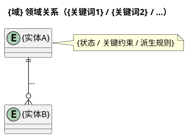
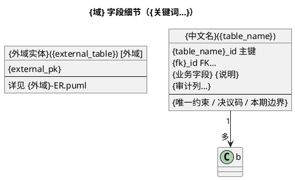

# PlantUML 模板

无同仓先例时使用。有 `*-ER.puml` / `*-字段细节.puml` 时优先模仿本仓写法，仅用本文补缺口。

占位符：`{域}`、`{域简称}`、`{产出目录}`、审计列名以开场探测到的本仓习惯替换。

## ER 骨架

## 字段细节

## 写法要点

- ER 用 `entity`；字段细节用 `object { … }`。
- 关系边与 note 写业务约束，不写具体语言类型。
- 共享附件/素材表：按本仓既有挂载方式注明（常见为关联 id + 业务类型），不强行发明物理 FK。
- 派生态优先写「不落库、如何派生」，除非用户明确要求冗余列。
